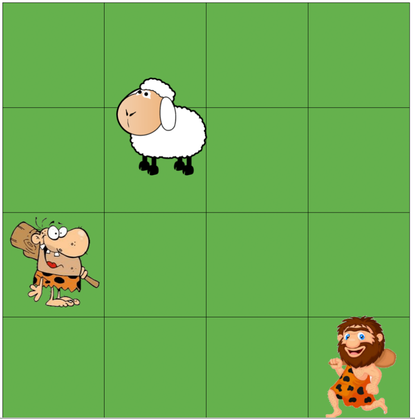

# Bayesian-Network

Two cavemen from Stone-age are trying to capture a sheep. Obviously the sheep can run faster than the cavemen. The cavemen are starving and if they do not get the sheep within a certain amount of time (turns) they may die out of hunger.The strategy to capture the sheep involves predicting where the sheep is going to flee to or try to lure it into a corner

# BN setup
Bayesian Network Setup
For coupling the Bayesian Network together with the caveman agent in the code, a set of input
and output is required. The input for the Bayesian Network is given by the agent code, and the
Bayesian Network returns the new probabilities. These are used to make an output choice.
